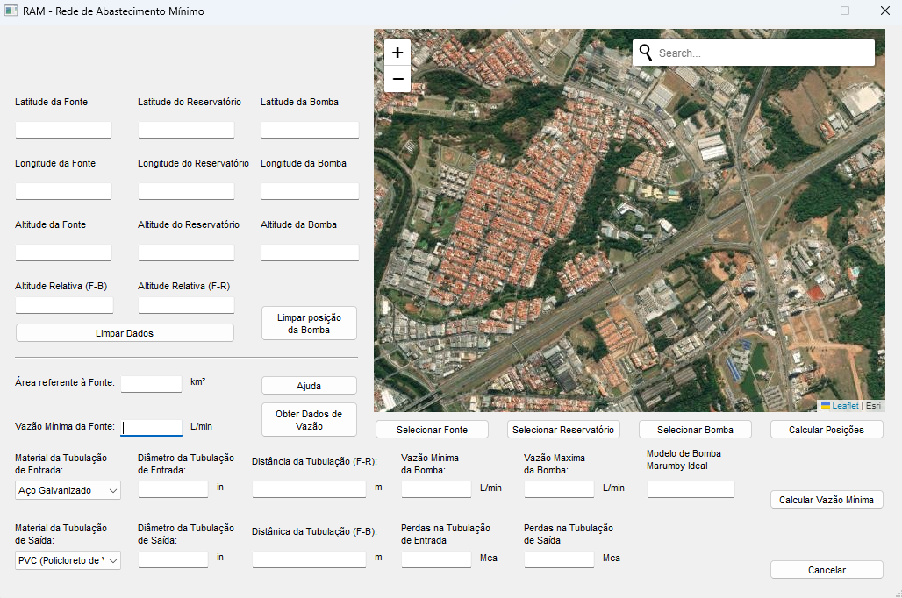

# Hammer Pump

The goal of this project is to empower isolated communities in Brazil by providing them with an efficient, affordable, and reliable pumping system. The RAM Pump emerges as a potent solution that could potentially address numerous water supply insecurities globally. However, the calculations required to accurately estimate the flow and other aspects of the pump post-installation are empirical and necessitate substantial prior knowledge of the technology. Bearing this in mind, I partnered with a prominent RAM Pump manufacturer in Brazil -  [Bombas Marumby](https://www.marumbybombas.com.br/) - to obtain their equipment data and systematize the required calculations.

This project is a Python-based GUI application that interacts with a map, calculates distances, and performs hydraulic calculations for determining the flow and pressure using height and water availability data. 

It uses PyQt5 for the GUI, folium for the map, and requests for HTTP requests to the Google API and the [Mapa de Regionalização de Vazões](http://www.leb.esalq.usp.br/leb/wolff/rv/), a Brazilian project for water availability estimation.



## Getting Started

These instructions will get you a copy of the project up and running on your local machine for development and testing purposes.

### Prerequisites

You need to have the following packages installed:

- PyQt5
- folium
- requests
- scipy

You can install them using pip:

```python
pip install PyQt5 folium requests scipy
```

### Running the Application

To run the application, navigate to the directory containing the `Interface.py` file and run the following command:

```python
python Interface.py
```

## Features

The application has the following features:

- Interact with a map to select coordinates.
- Calculate the distance between two points on the Earth's surface, taking into account the difference in altitude.
- Perform hydraulic loss calculations using the Darcy-Weisbach equation.
- Extract specific values from a web page using HTTP requests (Google API Key and authorization required).

## Built With

- [Python](https://www.python.org/) - The programming language used.
- [PyQt5](https://www.riverbankcomputing.com/software/pyqt/intro) - Used to create the GUI.
- [folium](https://python-visualization.github.io/folium/) - Used to interact with the map.
- [requests](https://requests.readthedocs.io/en/master/) - Used to send HTTP requests.
- [scipy](https://www.scipy.org/) - Used for scientific computations.

## License

This project is licensed under the MIT License - see the [LICENSE.md](LICENSE.md) file for details